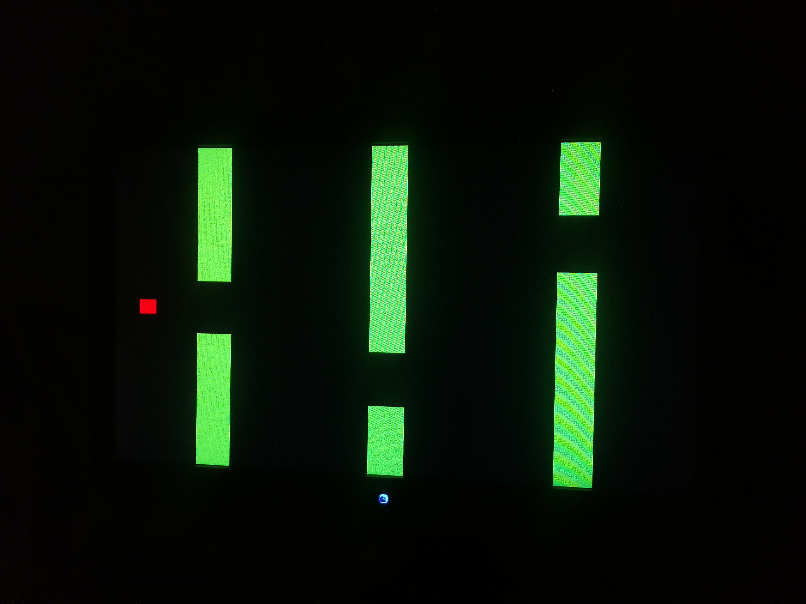
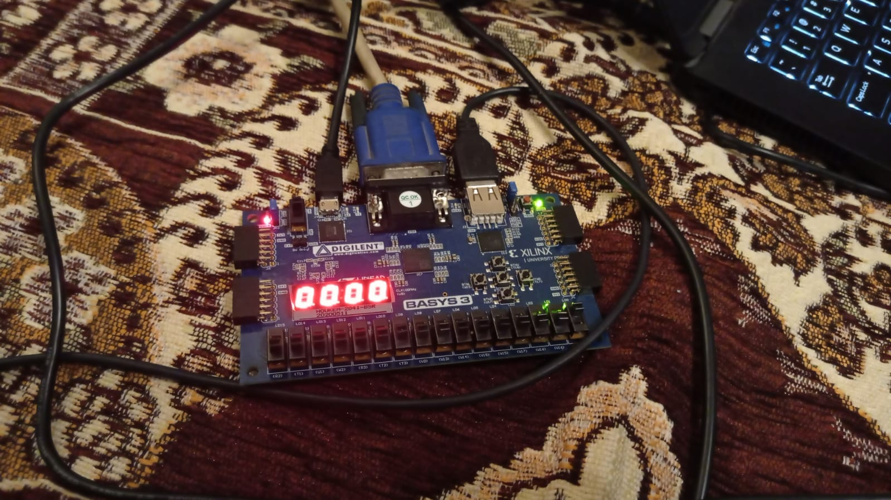

# Flappy Bird

## Description
This is a Flappy Bird game coded in Hardware Description Language (HDL) `Verilog` for the `FPGA` board `Basys 3 Artix-7`.

## How to play
The game is simple. The player controls a bird, and the bird must not touch the pipes. The bird can be moved up or down by pressing the `W` or `S` key respectively. The bird will keep moving in the direction it was last moved until the player presses the other key. The bird will die if it touches the pipes or the ground. The player can restart the game by pressing the `R` key. The score is displayed on the seven-segment display on the FPGA board.

## How to run
1. Download the project.
2. Open the project **finalEDA** in `Vivado`.
3. Generate the bitstream.
4. Program the FPGA board.
5. Connect the VGA monitor to the VGA port of the FPGA board.
6. Connect the USB keyboard to the USB port of the FPGA board.
7. Play the game.

## Screenshots

## Acknowledgements
This project was done as part of the course **EE/CS 172/130 Digital Logic and Design** at **Habib University, Karachi**. The course was taught by [Junaid Ahmed Memon](https://eng.ox.ac.uk/people/junaid-ahmed-memon/).

## Authors
- [Ali Asghar Chakera](https://github.com/aliasgharchakera)
- [Azeem Haider](https://github.com/A-Haider13)
- [Musab Sattar](https://github.com/musabsattar70)
- [Shahid Mahmood](https://github.com/MshahidMahmood)